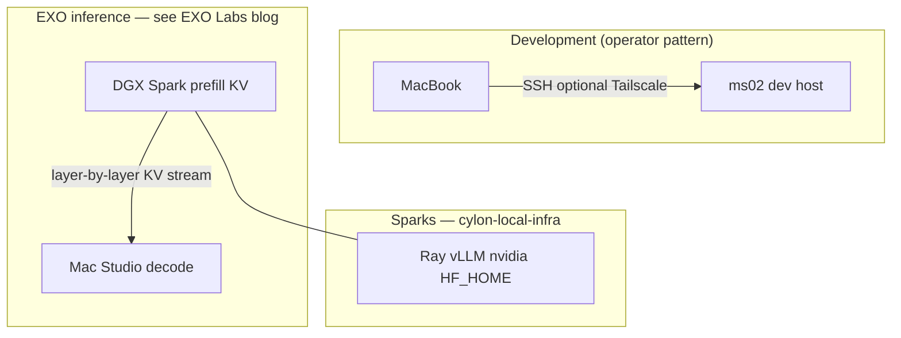

# EXO topology (draft)

| Field       | Value                                                                                                                                                                                                                                                 |
| ----------- | ----------------------------------------------------------------------------------------------------------------------------------------------------------------------------------------------------------------------------------------------------- |
| **Status**  | **Draft** — exploratory; not a committed product or network design                                                                                                                                                                                    |
| **Owner**   | Platform / infra (Microscaler)                                                                                                                                                                                                                        |
| **Repo**    | `cylon-local-infra` (Ansible + docs)                                                                                                                                                                                                                  |
| **Related** | [PRD-nvidia-user-exo-transition.md](PRD-nvidia-user-exo-transition.md), [PRD-spark-stacking-nvidia2.md](PRD-spark-stacking-nvidia2.md), [vllm-multi-node.md](vllm-multi-node.md), [docker-dev-host.md](docker-dev-host.md), [README.md](../README.md) |

This document sketches how **EXO** relates to **NVIDIA DGX Spark** hosts, **Apple Mac Studio** nodes, and the **remote dev host (`ms02`)** driven from a **MacBook**. [PRD-nvidia-user-exo-transition.md](PRD-nvidia-user-exo-transition.md) states that **exact EXO topology is TBD**; requirements there are **interfaces and hygiene**, not EXO code.

**Primary external reference (EXO product behavior):** [NVIDIA DGX Spark + Apple Mac Studio for LLM inference with EXO 1.0](https://blog.exolabs.net/nvidia-dgx-spark/) (EXO Labs, 2025).

---

## 1. Why this draft exists

- **EXO readiness** in the PRDs means **stable contracts** on **Sparks**: runtime user `**nvidia`**, predictable **ports**, **OpenAI-compatible** URLs where applicable, **Ray** / **vLLM** ops, observability hooks, and **no long-term reliance on root-only paths**.
- This file separates: **(A)** where you develop (**MacBook → `ms02`**), **(B)** how **EXO** uses **Spark + Mac Studio** together for inference (heterogeneous cluster), **(C)** what **this repo** provisions (**Ansible** on Sparks and `**dev_hosts`**).

---

## 2. How EXO combines DGX Spark and Mac Studio (per EXO Labs)

EXO Labs describes **heterogeneous** LLM inference: **different hardware for prefill vs decode**, not “everything on one box.”

| Phase                                              | Bottleneck                         | Favored hardware (blog)                                                                                                                                                                            |
| -------------------------------------------------- | ---------------------------------- | -------------------------------------------------------------------------------------------------------------------------------------------------------------------------------------------------- |
| **Prefill** (prompt → KV cache; drives **TTFT**)   | **Compute-bound** at large context | **DGX Spark** — high FP16 throughput (~100 TFLOPs class in their write-up vs ~26 TFLOPs on M3 Ultra Mac Studio in the same post).                                                                  |
| **Decode** (autoregressive tokens; drives **TPS**) | **Memory-bandwidth bound**         | **Mac Studio (M3 Ultra example)** — very high **unified memory bandwidth** (~~819 GB/s) vs Spark’s **~~273 GB/s** in the article, with large unified memory (e.g. 512 GB in their M3 Ultra stack). |

**Mechanism:** **Disaggregated prefill and decode** with **layer-by-layer KV streaming**: prefill runs on Spark, KV moves to the Mac Studio, **decode** runs there; transfers **overlap** layer-wise with compute so network cost can be hidden above context-length thresholds (the post derives when **transfer time is less than compute time** for full overlap, with examples for **10 GbE** between devices).

**EXO 1.0 (product claim):** On start, EXO **discovers** devices on an **ad-hoc mesh**, **profiles** throughput / memory / network, and **plans** placement (prefill vs decode, pipelining, KV streaming) without hand-written schedules.

**Implication for this repo:** `**cylon-local-infra`** converges **Sparks** (and `**ms02`**) for **OS, users, CUDA, Ray, vLLM**, etc. **EXO** adds the **cross-device inference runtime** and scheduling between **Spark** and **Mac Studio**. Those are **different layers** — you still want **clean Spark** images and networking; EXO consumes the cluster as **discovered peers**.

---

## 3. Devices and roles (intended direction)

| Machine                   | Role                                                                                                                                                                      | Notes                                                                                                                                                                                      |
| ------------------------- | ------------------------------------------------------------------------------------------------------------------------------------------------------------------------- | ------------------------------------------------------------------------------------------------------------------------------------------------------------------------------------------ |
| **MacBook**               | **Portable client** — connect to `**ms02`** (and optionally Sparks / jump hosts)                                                                                          | **Development / Ansible control** — not an EXO inference node. **Tailscale** or VPN for mobility.                                                                                          |
| `**ms02` (dev host)**     | **Remote development server** — Docker CE, Kind, buildx, **act** ([docker-dev-host.md](docker-dev-host.md))                                                               | **Not** the Mac Studio; **not** EXO’s decode target unless you explicitly install EXO there (usually **no**).                                                                              |
| **Mac Studio (EXO node)** | **EXO cluster participant** — in EXO’s architecture, a **high memory-bandwidth** peer for **decode** (and large unified RAM), **not** a “desktop IDE” in this topology    | Install/run **EXO** per upstream; **mesh + 10G+ class links** to Sparks matter for KV streaming (see blog). **Future M5 / 1 TB** configs extend capacity for EXO-planned decode and cache. |
| **DGX Spark (`nvidia`*)** | **NVIDIA fleet** — **prefill-friendly** high compute, **Ray**, **vLLM** for **single-stack** serving in **this repo**; **also** the **prefill** side when EXO splits work | [vllm-multi-node.md](vllm-multi-node.md), stacking PRD; interconnect for Spark↔Spark; **add** LAN/mesh paths to Mac Studio for **EXO** as required by product.                             |

**Ansible control plane:** Runs **from the MacBook** (or CI) against inventory — **not** from the Mac Studio unless you choose that.

---

## 4. Logical layers (development vs EXO inference vs Ansible)

- **Left:** Day-to-day **engineering** — unchanged: **MacBook → `ms02`**.
- **Center:** **EXO** routes **prefill** toward **Spark** and **decode** toward **Mac Studio** when that split wins (automatic in EXO 1.0 per blog).
- **Right:** What **this repository** **installs and configures** on Sparks; **vLLM-only** multi-node stacks remain valid **without** Mac Studio if you are not running EXO’s disaggregated path.

---

## 5. Connectivity (Tailscale, LAN, and EXO mesh)

- **Operator access:** MacBook ↔ `**ms02`** / Sparks via **SSH**; **Tailscale** or VPN as today.
- **EXO inference path:** Requires **low-latency, sufficient bandwidth** between **Spark** and **Mac Studio** for **KV streaming** (blog uses **10 GbE** in the worked example). **Plan links** (dedicated NICs, switch, or mesh) as a **platform** concern alongside **interconnect** for Spark↔Spark NCCL/Ray.

---

## 6. Roles vs hardware (detail)

| Component          | Typical role                                             | Notes                                                                                 |
| ------------------ | -------------------------------------------------------- | ------------------------------------------------------------------------------------- |
| **MacBook**        | SSH to `**ms02`**, Ansible, IDE remote                   | Not an EXO server.                                                                    |
| `**ms02**`         | Kind, Docker, act                                        | `**dev_hosts**` inventory.                                                            |
| **Mac Studio**     | **EXO decode / high-bandwidth** node in EXO mesh         | Per [EXO blog](https://blog.exolabs.net/nvidia-dgx-spark/); **not** primary IDE here. |
| **Each Spark**     | **EXO prefill** + **Ray/vLLM** automation from this repo | Firewall, `**nvidia`**, CUDA, optional **stacked** vLLM without EXO.                  |
| **EXO (software)** | Discovery, profiling, disaggregated scheduling           | [exo-explore/exo](https://github.com/exo-explore/exo) / EXO Labs releases.            |

---

## 7. Stable interfaces (this repo / Sparks — EXO-facing hygiene)

Aligned with [PRD-nvidia-user-exo-transition.md §8](PRD-nvidia-user-exo-transition.md):

| Interface                 | Contract (defaults from group_vars)                          |
| ------------------------- | ------------------------------------------------------------ |
| **Inference (vLLM path)** | OpenAI-compatible HTTP on Spark leader, `**vllm_api_port`**. |
| **Ray**                   | `**RAY_ADDRESS=…:vllm_ray_port`**.                           |
| **Identity**              | Services as `**nvidia`**.                                    |
| **Logs**                  | `**journalctl`** for `vllm` / `vllm-stacked` / `ray-*`.      |

When **EXO** fronts inference, it may expose its **own** API — still keep **Spark** **predictable** for debugging and for **non-EXO** vLLM runs.

---

## 8. Scaling Sparks (two → eight example)

Inventory `**sparks`**, parity playbooks, **Ray**, **TP/PP** vars. EXO may additionally **assign** Sparks to **prefill** shards across **multiple** units; **this repo** does not implement EXO scheduling — only **host readiness**.

---

## 9. Multi-model and routing

- **Without EXO:** **vLLM** + optional router; HF weights on Sparks.
- **With EXO:** Product may **split** phases across **Spark + Mac Studio**; large **decode-side** memory on Mac Studio can hold **decode-heavy** work while Sparks handle **prefill** — see blog benchmarks (e.g. **Llama-3.1 8B** combined vs single-device).

---

## 10. Model size (ballpark only)

Unchanged: validate on hardware. EXO’s post focuses on **latency** (**TTFT** / **TPS**) and **phase placement**, not raw “largest single checkpoint” — **heterogeneous** clusters change the **bottleneck**, not remove **OOM** limits.

---

## 11. Ansible implications

- `**sparks`** vs `**dev_hosts**`: unchanged separation.
- **Mac Studio:** **not** managed by `**dev_hosts.yml`** unless you treat it as a generic SSH host with a **separate** inventory group for **EXO** bootstrap (out of scope here).
- **Network:** document **Spark ↔ Mac Studio** reachability for operators when **EXO** is in use.

---

## 12. Open decisions

1. **Network design** for **EXO** KV streaming vs **NCCL interconnect** (same vs separate links).
2. **EXO** version and install path on **Mac Studio** vs **Spark** sidecars.
3. **Ray head:** single vs HA when **multiple** Sparks feed EXO **prefill**.
4. **Generalize** **`provision_sparks.yml`** / **`spark_provision_vllm_stack`** for **N** Sparks for **non-EXO** vLLM-only stacks.

---

## 13. References

- **EXO Labs — DGX Spark + Mac Studio + EXO 1.0:** [blog.exolabs.net — NVIDIA DGX Spark](https://blog.exolabs.net/nvidia-dgx-spark/)  
- [PRD-nvidia-user-exo-transition.md](PRD-nvidia-user-exo-transition.md)  
- [PRD-spark-stacking-nvidia2.md](PRD-spark-stacking-nvidia2.md)  
- [vllm-multi-node.md](vllm-multi-node.md)  
- [docker-dev-host.md](docker-dev-host.md)  
- [README.md](../README.md)

When EXO architecture is **fixed** in your environment, add a **versioned** runbook; keep **cylon-local-infra** focused on **reproducible host state** for `**sparks`** and `**dev_hosts**`.