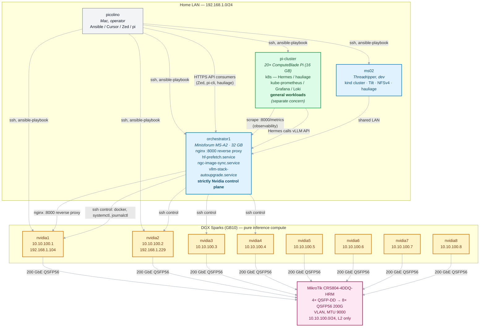
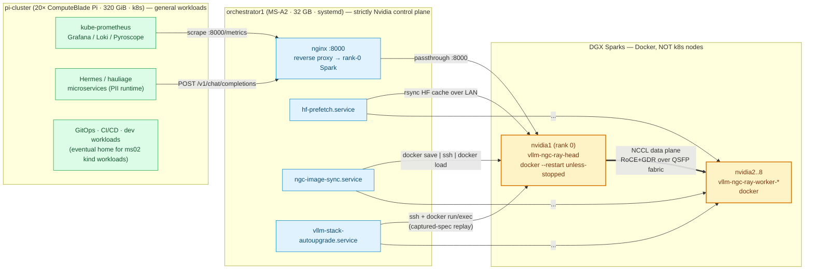

# 8-Spark fabric + MS-A2 orchestrator

Forward-looking architecture for the **near-future fleet expansion** from
2× DGX Spark direct-cabled, to **8× DGX Spark behind a switched 200/400 GbE
fabric, fronted by a dedicated control-plane host**. Captures the migration
plan, the topology, the **Docker-vs-k8s decision** for the inference
nodes, and the **production model** decision for the TP=8 deployment shape.

> ## 📌 Status: IN PROGRESS — Sparks 3–8 arrived 2026-05-20 (MS-A2 + switch TBD)
>
> The architecture, model selection, migration phases, and Docker-vs-k8s
> decision are **all settled** in this page. **No further repo changes
> are scheduled** until three pieces of hardware land:
>
> 1. **Minisforum MS-A2** (32 GB) — future `orchestrator1`, dedicated
>    Nvidia control-plane host. Unblocks Phases 2-3.
> 2. **MikroTik CRS804-4DDQ-HRM** — QSFP-DD switch with breakout to 8×
>    QSFP56 200 GbE. Unblocks Phases 1, 4.
> 3. **Sparks 3-8** (6× additional DGX Spark) — completes the 8-node
>    fleet. Unblocks Phases 5-7.
>
> Today's 2-Spark cluster on `nvidia1` + `nvidia2`, running 26.03-py3 +
> Ray + TP=2 with Qwen3.6-35B-A3B-FP8, **stays exactly as it is**. See
> [Next actions](#next-actions-on-hardware-arrival) below for what to do
> the day each piece of hardware shows up.
>
> Each phase remains independently shippable, on the live cluster, in a
> maintenance window — when the hardware is here.

## Use-case constraint (drives the rest)

This cluster serves a **single user** running **one big model** at a time
— specifically the largest, highest-quality model that maximises **hard
reasoning + agentic coding** (the operator's day-to-day workload is hard
projects, multi-file refactors, long architectural conversations).
**Vision capability is a major plus** — diagrams from whiteboards / photos,
UI mockups, error/dashboard screenshots, scanned PDFs, code-in-screenshot
review all happen often enough to want vision in the daily driver, not as
a one-off swap.
The model must fit at `gpu_memory_utilization=0.75-0.80` per rank under
TP=8 across the 8 Sparks. Concurrency / multi-tenant / replica-DP is
explicitly **not** the goal.

Implications throughout this page:

- **Deployment shape is fixed at TP=8 single replica.** No DP. No
  scheduling concerns; no rolling per-replica updates; no upstream
  load-balancing on the orchestrator (just a pass-through reverse proxy
  to whichever Spark is rank 0).
- **Latency per token matters more than aggregate throughput.** Single
  stream is the only stream. MoE models with low active-param counts are
  attractive (Qwen3-235B-A22B, Nemotron-3-Super-120B-A12B) because decode
  cost scales with active params, not total params.
- **The case for k8s on the Sparks gets weaker.** Replica scheduling was
  one of its only genuine wins; with a single replica it doesn't apply.
  See the [decision section](#decision-docker--ansible-vs-kubernetes-on-the-sparks)
  below — recommendation strengthens to "stay on Docker + Ansible".
- **Orchestrator role simplifies twice.** No `upstream { server …; server
  …; }` block in nginx (single backend), AND with the Pi cluster taking
  over Hermes/observability/general workloads, MS-A2 stays pure systemd
  (32 GB RAM is enough for that scope; no need for k3s on the
  orchestrator).
- **Model selection becomes the primary architectural decision** — not
  topology or parallelism shape. See
  [Model-fit at TP=8](#model-fit-at-tp8-coding--reasoning-vision-optional-fits-075080-per-rank)
  below.

## Hardware roster (target)

| Role | Model | Count | Network | Notes |
|---|---|---|---|---|
| **Operator workstation** | Mac (picolino) | 1 | LAN 192.168.1.x | Ansible controller, Cursor/Zed/pi clients. **Unchanged.** |
| **Dev / kind host** | Threadripper (`ms02`) | 1 | LAN 192.168.1.189 | kind cluster, Tilt, NFSv4, GitOps for hauliage / Hermes. Some workloads will migrate to the Pi cluster over time, but ms02's role here is unchanged by the Spark expansion. |
| **Inference compute** | NVIDIA DGX Spark (GB10) | **8** (1+1 today; +6 incoming) | LAN + 200 GbE QSFP56 fabric | Pure compute targets after migration. Running Docker via `roles/vllm_stacked_container`, scaled from N=2 to N=8. **Stays on Docker + Ansible** — see the [decision section](#decision-docker--ansible-vs-kubernetes-on-the-sparks). |
| **Inference control plane** | Minisforum **MS-A2** (Ryzen 9 7945HX, 16 Zen4 / 32 thread, **32 GB DDR5** as spec'd, 2.5 GbE LAN ×2, USB4, 3× M.2 NVMe) | **1** | LAN only | New host (`orchestrator1`). Hosts nginx reverse proxy `:8000`, `hf-prefetch.service`, `ngc-image-sync.service`, `vllm-stack-autoupgrade.service`. **Strictly for the Nvidia cluster** — does not run k3s, does not host Hermes / observability / general workloads (those land on the Pi cluster). 32 GB fits this scope comfortably (~2 GiB resident, ~30 GiB headroom for HF model staging). RAM can be expanded to 96 GiB later if scope grows. **Not on the QSFP fabric** — control plane is LAN-side only. |
| **General workloads cluster** | **ComputeBlade Raspberry Pi 5** (16 GB / 4-core each) | **20 blades** (~320 GiB RAM, ~80 cores total) | LAN | New cluster, separate from the Nvidia stack. **Hosts k8s** (k3s or full upstream) for Hermes / hauliage microservices, kube-prometheus / Grafana / Loki observability, and any non-GPU-bound workloads. Long-term home for things currently on ms02's kind cluster. **Not in scope of this page** beyond noting that observability + microservices live there, not on `orchestrator1`. |
| **Interconnect switch** | **MikroTik CRS804-4DDQ-HRM** (4× QSFP-DD 100/200/400 GbE, 1× 25 GbE SFP28, 1× 1 GbE mgmt RJ45, 1U, RouterOS or SwOS) | 1 | dedicated VLAN, MTU 9000 | Each QSFP-DD breaks out to **2× QSFP56 200 GbE** with breakout DAC/AOC → 4 × 2 = **8 endpoints @ 200 GbE** = exact fit for 8 Sparks. |

## Topology

The diagram separates the **LAN control plane** (low-bandwidth, all hosts)
from the **QSFP data plane** (NCCL all-reduce on the switched fabric, Sparks
only). The orchestrator coordinates the cluster but never carries a tensor.

**Two distinct planes:**

- **Control plane** (thin grey edges): operator → `orchestrator1` over LAN
  for `ansible-playbook`, `ssh`, HTTP API; `orchestrator1` → Sparks for
  `docker`, `systemctl`, `journalctl`, c10d/Ray-head rendezvous.
  Bandwidth-trivial; 2.5 GbE LAN is plenty.
- **Data plane** (thick pink edges): NCCL all-reduce / RoCE+GDR over the
  QSFP fabric, between Sparks only. The orchestrator is **not** on this
  fabric and doesn't need to be — c10d rendezvous bootstrap is over LAN, and
  `MASTER_ADDR` for NCCL points at the rank-0 Spark's QSFP IP so NCCL traffic
  stays on the QSFP fabric.

## Network plan: link-local must die

Today the 2-Spark direct-cable interconnect is **`169.254.0.0/16`** (IPv4
link-local, autoconfigured via IPv4LL). Through a switch this breaks: many
switches actively block link-local, and at scale you want stable, manually
assigned IPs that survive a host reboot in a known way.

Migration plan (compatible with today's 2-Spark cluster — can be done
**before** the switch arrives):

| Layer | Today | Future |
|---|---|---|
| Subnet | `169.254.0.0/16` | `10.10.100.0/24` (or your existing convention) |
| Per-host IP | autoconfigured via `dhcpcd`/IPv4LL | static, in `inventory/host_vars/nvidia<N>.yml` (see roster table above) |
| Discovery | `ip -4 addr show enp1s0f0np0` | unchanged (role discovers the IPv4 dynamically) |
| `nccl_interface` | `enp1s0f0np0` | unchanged |
| `firewall_spark_interconnect_cidr` | `169.254.0.0/16` | `10.10.100.0/24` |
| MTU | jumbo (9000) on direct cable | jumbo (9000) on switched fabric |
| L2 / L3 | direct cable, link-local broadcast | switch in L2-only mode, single VLAN, no L3 routing on this fabric |

The CIDR change is purely an inventory + firewall edit. The role's
`Discover IPv4 on interconnect interface` task picks up whatever the kernel
reports; nothing in `vllm_distributed_extra_env` is keyed on the address
family.

## Repo readiness check (good news: very little surgery)

Walking the role hot-paths from N=2 to N=8:

| Concern | Today | Generalises to N? | Action |
|---|---|---|---|
| `inventory/hosts.yml` `sparks` group | 2 hosts | ✅ | Add `nvidia3..nvidia8` lines |
| `nccl_interface` (group_var) | shared | ✅ | unchanged |
| `vllm_distributed_extra_env` (NCCL/UCX/etc.) | shared | ✅ | unchanged |
| Role's leader = `groups['sparks'] \| sort \| first` pattern | works | ✅ | unchanged |
| `hf-prefetch.service` peer iteration | rsyncs to "all-but-self" | ✅ | unchanged once peer list comes from inventory |
| `ngc-image-sync.service` peer iteration | iterates `peers:` config | ✅ | unchanged |
| `vllm-stack-autoupgrade.service` `peers:` list | **1 hardcoded entry** today | ⚠ | role needs to render `peers:` from inventory iteration; see [open follow-ups](#open-follow-ups) |
| `firewall_spark_interconnect_cidr` | `169.254.0.0/16` | ✅ | flip to `10.10.100.0/24` |
| `roles/spark_provision/tasks/main.yml` includes | `apply: { tags: [...] }` fixed in [2026-04-29 run](../runs/2026-04-29-cluster-recovery-and-26.04-rollback.md) | ✅ | done |
| `just spark-vllm-*` recipes hardcoding `nvidia1` / `nvidia2` | several | ⚠ | rewrite to iterate `groups['sparks']` (or use `ansible sparks -m shell -a …`) |
| Container names | `vllm-ngc-ray-head` (leader) / `vllm-ngc-ray-worker-<host>` (follower) | ✅ | already templated by `inventory_hostname` |
| Ray dashboard binding (`:8265`) | leader | ✅ | unchanged; one dashboard wherever rank 0 lands |

Two real action items: autoupgrade peers-list rendering, and justfile
recipe templating. Both are afternoon-sized.

## Migration phases

Each phase is independently shippable, in a single maintenance window, on
the live cluster.

| Phase | What | Why | Depends on |
|---|---|---|---|
| **0 — now** | Keep cluster pinned to 26.03-py3 + Ray (see the [2026-04-29 postmortem](../runs/2026-04-29-cluster-recovery-and-26.04-rollback.md)). Don't chase 26.04+ until role is rewritten for `external_launcher`. | We've stabilised on 26.03; let it cook. | — |
| **1 — link-local → 10.10.100.0/24** | Static IPs in `host_vars/nvidia{1,2}.yml`; flip `firewall_spark_interconnect_cidr`; reboot Sparks to renumber `enp1s0f0np0`. | Pre-requisite for switch insertion. Works on the direct cable too — zero perf change. | nothing |
| **2 — MS-A2 arrives** | Provision `orchestrator1` (host_vars + new inventory group); deploy nginx reverse-proxy `:8000 → nvidia1:8000`; **point downstream consumers at `http://orchestrator1:8000`**. ms02 stays as dev host. | Stable LAN endpoint independent of which Spark is rank 0; the gateway lives in the right place from day 1. | Phase 1 |
| **3 — relocate leader-only daemons + HF cache origin** | Move `hf-prefetch.service`, `ngc-image-sync.service`, `vllm-stack-autoupgrade.service` from `nvidia1` to `orchestrator1`. Update autoupgrade role to render `peers:` from inventory. **The HF cache origin moves with `hf-prefetch.service`** — `orchestrator1`'s NVMe (3× M.2 slots = several TB) becomes the master cache; how Sparks consume it (NFS-mounted vs rsync'd local copy vs hybrid) is the [open question below](#open-follow-ups). **Until this phase lands, do not add new big models to `hf_prefetch_models`** — there's no point filling Spark disks for a model the cluster can't serve yet (still TP=2 on 26.03 + Ray; the new TP=8 daily-driver Qwen3-VL-235B-A22B-FP8 only becomes runnable post-Phase-5). | Frees Sparks to be pure compute, centralises cache management, defers ~235 GiB of disk pressure per Spark for the new model until the cluster can actually use it. | Phase 2 |
| **4 — switch arrives** | Cable up the existing 2 Sparks via QSFP-DD breakout; flip them off direct-cable to switched fabric. NCCL env unchanged. | Validates the switched fabric on a known-good 2-node config. | Phase 1 (subnet must be routable) |
| **5 — Sparks 3-8 land** | Add to inventory, assign IPs `.3` … `.8`; provision via existing playbook (`spark_provision`). | Pure config — `groups['sparks']` pattern handles N. | Phase 4 |
| **6 — TP=8 single-replica deploy with chosen model** | Deploy **Qwen3-VL-235B-A22B-FP8** (production daily driver, decided 2026-04-29) via `roles/vllm_stacked_container` with TP=8 + rank-aware `host_vars`. nginx on `orchestrator1` is a single-backend passthrough (no upstream block). Smoke-test on Phi-4-reasoning-plus-NVFP4 first to validate TP=8 plumbing; bring up VL-235B as the production daily; A/B with Qwen3-Coder-480B / DeepSeek-V3.2 for specialist stretches. Re-validate boot timeline + steady-state decode rate. **Sibling of this phase**: stand up an [auxiliary small model on `orchestrator1`](./auxiliary-model-isolation.md) (vLLM-CPU on `:8001` or Ollama) so Hermes auxiliary classes (`compression`, `flush_memories`, `session_search`, `title_generation`, `web_extract`, `skills_hub`, `approval`, `mcp`) stop landing on the primary `:8000` endpoint — see [auxiliary-model-isolation concept](./auxiliary-model-isolation.md) Pattern C. | The use-case is **single user, hard reasoning + agentic coding, vision a major plus** — see the [Model-fit table](#model-fit-at-tp8-coding--reasoning-vision-optional-fits-075080-per-rank) for full rationale. | Phase 5 |
| **7 — re-evaluate 26.04 / torchrun** | At 8 nodes with replica DP, abrupt-power-offs stop being existential. May or may not be worth the lift. | Lower urgency once we have replica redundancy. | Phase 6 |

## Decision: Docker + Ansible vs Kubernetes on the Sparks

Open question this concept page is filed to resolve: when we expand to 8
Sparks, do they stay on the simple Docker + Ansible pattern we operate
today, or do they become **k3s/k8s nodepool workers** running the vLLM
engine as a single pod each?

### Quick verdict

> **Keep simple Docker + Ansible on the Sparks.** Run k3s on
> `orchestrator1` for everything that **isn't** the inference engine
> (gateway, daemons, observability, optional Hermes runtime). This is the
> hybrid pattern; it captures most of the upside without paying the k8s
> complexity tax on the GPU hosts. Defer "join Sparks into the k3s cluster"
> until there's a second-axis concern (multi-tenant workloads on the
> Sparks, GitOps mandate, fleet > 16 nodes).

### Decision matrix

| Concern | **Docker + Ansible** (current) | **K3s/K8s pod-per-Spark** |
|---|---|---|
| Setup complexity | low (we already have it) | high (kubelet, etcd/k3s server, CRI, CNI, DNS, NVIDIA GPU Operator, image registry) |
| Operator skill required | bash + Ansible + Docker | the above + helm/kubectl, kube-prometheus, NetworkPolicy semantics |
| Failure modes added by the platform | none (just docker daemon) | etcd corruption, kubelet+CRI version mismatches, CNI flapping, cert rotation, GPU Operator quirks |
| Declarative state | inventory + role + `--restart unless-stopped` | `Deployment`/`StatefulSet`/`DaemonSet` |
| Self-healing — pod crash | `--restart unless-stopped` | kubelet restart |
| Self-healing — host crash | role re-provision on next playbook run | scheduler re-places pods (within node constraints) |
| Self-healing — vLLM serve crash | none today (it's a `docker exec -d` payload; needs `spark-vllm-api-restart`) | kubelet sees container crashed and restarts. **Genuine win.** |
| Rolling image upgrade | `vllm-stack-autoupgrade.service` (custom Python, ~600 LOC) | `kubectl set image deploy/vllm vllm=…:26.05-py3`. **Genuine win.** |
| Multi-replica deployment (DP) | Ansible iteration over `groups['sparks']`; manual rank assignment via `host_vars` | `replicas: N` + `topologySpreadConstraints`. Genuine win at N≥4 — but **N/A for our use case** (single-user, single-replica TP=8; see top of page). |
| API surface routing | nginx upstream block on `orchestrator1` (Phase 2-3 above) | `Service` ClusterIP + `Ingress` (or LoadBalancer with MetalLB) |
| Multi-tenant / mixed workloads | hard (Docker, no namespacing for compute resources) | easy (Namespaces, ResourceQuota, NetworkPolicy) |
| GPU-as-resource scheduling | implicit (`--gpus all` on docker run) | explicit (`nvidia.com/gpu: 1` request/limit, NVIDIA Device Plugin enforces) |
| NCCL + RoCE + GDR | host network, jumbo MTU, all "just works" today | needs `hostNetwork: true` (loses pod IP isolation) **OR** Multus + SR-IOV + RoCE-aware CNI (much more complex). RoCE inside a CNI overlay is a research project. |
| Model weights storage | `/home/nvidia/.cache/huggingface` on each Spark + `hf-prefetch.service` rsync | NFS CSI driver mounting from `orchestrator1`, or `hostPath` (which defeats some of k8s's portability). Adds image-pull-equivalent for weights. |
| Image distribution | `ngc-image-sync.service` `docker save | docker load` via SSH (works today) | Local registry on `orchestrator1`; Sparks pull. Simpler at fleet scale. |
| Observability | Prometheus on `:8000/metrics` + ad-hoc | kube-prometheus stack, OpenTelemetry, Lens/k9s, etc. |
| Aligns with what we already do | yes (matches `roles/vllm_stacked_container`) | partial (ms02 already runs kind for dev — k8s muscle memory exists) |
| Aligns with NVIDIA's published patterns | yes (`run_cluster.sh`, `dgx-spark-playbooks`) | not really — NVIDIA's published Spark playbooks are all bash + Docker so far |
| What it doesn't fix | hardware abrupt power-offs ([2026-04-27 postmortem](../runs/2026-04-27-ray-head-exited-postmortem.md)); the 26.04 ray-removal ([2026-04-29 postmortem](../runs/2026-04-29-cluster-recovery-and-26.04-rollback.md)) | same — k8s doesn't make Spark hardware more reliable, and the pod still has to know how to `vllm serve` whatever the current image expects |

### What we'd realistically gain from full k8s on the Sparks

For our single-user / single-replica TP=8 use case, the two genuine wins
are **(a) automatic restart of `vllm serve` after a crash** and
**(b) declarative rolling image upgrades**. (Multi-replica DP scheduling —
the third potential k8s win — is N/A; we're not running multiple replicas.)
Both remaining wins are real operational improvements over today.

But (a) is also achievable with simple Docker — just bake `vllm serve` into
the container's entrypoint instead of injecting it via `docker exec -d`.
This is one of the open follow-ups from
[runs/2026-04-27-ray-head-exited-postmortem.md](../runs/2026-04-27-ray-head-exited-postmortem.md):
*"make `vllm serve` an entrypoint child of the head container instead of a
`docker exec -d` payload, so a host reboot brings up the API
automatically."* That single change recovers most of (a) without any of
the k8s complexity tax.

(b) is the harder one. `vllm-stack-autoupgrade.service` is custom Python
that captures + replays a docker spec. It's worked, it's also been
[broken twice in different ways](../runs/2026-04-29-cluster-recovery-and-26.04-rollback.md).
A k8s `Deployment` + `kubectl set image` would be unambiguously simpler
and safer here. But the daemon does today's job; the cost of replacing
it is the cost of moving everything else with it.

### Recommendation: three planes, clear responsibilities

The Pi cluster (20 ComputeBlades, ~320 GiB RAM total) is the new home for
everything microservices/observability-shaped. That makes the MS-A2 / k3s
question much simpler: **MS-A2 stays pure systemd**, doesn't run k3s,
doesn't host the observability stack, doesn't run Hermes. Its scope
collapses to "the lightweight, dedicated control plane for one specific
cluster (the Nvidia inference cluster)". 32 GB RAM is plenty for that.

**Why this lands well:**

- **Sparks stay simple.** No `kubelet`, no CNI, no GPU Operator, no NFS CSI
  driver. Just Docker + the `vllm_stacked_container` role we already
  battle-tested. Re-cabling and renumbering them in Phase 1+4 above doesn't
  intersect with k8s at all.
- **MS-A2 stays simple.** Pure systemd, three Python daemons, one nginx
  config. 32 GB RAM is comfortable for this scope (~2 GB resident, headroom
  for HF model staging). No etcd, no kubelet, no certificate rotation, no
  CNI to babysit. Keeps the Nvidia control plane as a "boring appliance".
- **Pi cluster owns the k8s problem.** Hermes runtime, observability stack,
  microservices, CI/CD, eventually replacing ms02's kind workloads — all
  the things that benefit from k8s scheduling get k8s. The Pi cluster is
  where k8s skill is exercised; it's where the operator-experience tax is
  worth paying.
- **Failure independence.** A churning Pi-cluster k8s upgrade does not
  affect the vLLM control plane. A flaky vLLM autoupgrade does not affect
  observability. Each plane has its own blast radius.
- **NCCL+RoCE stays on host network.** The hardest k8s-on-Spark problem
  (overlay CNIs eat NCCL performance, Multus + SR-IOV is a research
  project) is sidestepped entirely by keeping Sparks out of k8s for now.

### When we might revisit either of these

| If… | Then… |
|---|---|
| MS-A2's 32 GB stops being enough (e.g. someone wants Prometheus on it after all) | Bump RAM to 64/96 GB (the platform supports it) — *not* the trigger to add k3s. Keep the strict systemd scope; k8s lives on the Pi cluster. |
| Sparks fleet > 16 nodes | Operator overhead of Docker + Ansible iteration starts to bite. Reconsider Sparks-as-k8s-nodepool *then*, with the same caveats around NCCL+CNI. |
| Use-case shifts from "single user, single big model" to multi-tenant on the same Spark | k8s namespacing + ResourceQuota earn their keep. Today **not the case** per top-of-page constraint. |
| We get tired of the autoupgrade daemon and want `kubectl set image` instead | This is the cleanest argument for k8s-on-Sparks. Worth weighing against the cost of replacing the daemon. |
| Hermes co-location on GPU hosts becomes a latency requirement | Run Hermes-the-microservice on a Pi blade and have it call vLLM — latency budget on LAN is fine. Only co-locate if PII path measurably suffers. |

None of these is true today at 8 dedicated GPU hosts running one big
reasoning + coding model with Hermes on a separate physical chassis. So
**defer**.

## Model-fit at TP=8 (coding + reasoning, vision optional, fits 0.75–0.80 per rank)

The remit is **agentic coding + hard reasoning** (multi-file refactors,
long architectural conversations, deep code review). Vision is a bonus
but not the deciding criterion. Memory budget arithmetic: GB10 has 119.6
GiB visible to CUDA. At 0.80 util = ~96 GiB per rank × 8 ranks = ~766 GiB
total addressable. Of each rank's ~96 GiB, subtract ~5 GiB for NCCL
workspace + CUDA graphs + activations; the rest is **weights (TP-sharded
across 8 ranks) + KV cache + misc**. We default to 0.75 after the
[2026-04-29 abrupt-power-off](../runs/2026-04-29-cluster-recovery-and-26.04-rollback.md)
findings — standing UMA pressure may compound platform fragility.

> **Caveat**: weight footprints below are estimates from each model's HF
> card. Re-verify on HF before committing — quantization + sharding
> details shift between releases. Spark-specific compat for off-NVIDIA
> models needs operator verification (see "ASUS/NVIDIA matrix?" column).

| Model | Total / Active | Quant | Per-rank weight | Per-rank KV @ 0.80 | Coding | Reasoning | Vision | NVIDIA Spark matrix? |
|---|---|---|---|---|---|---|---|---|
| **Qwen3-Coder-480B-Instruct** | 480B / ~35B MoE | AWQ-INT4 | ~30 GiB | ~60 GiB → **256k+ ctx** | **purpose-built coder, agentic-tuned** | strong | ❌ | ❌ — verify |
| Qwen3-Coder-480B-Instruct | 480B / ~35B MoE | FP8 | ~60 GiB | ~30 GiB → ~80k ctx | same | strong | ❌ | ❌ — verify |
| **DeepSeek-V3.2 / R1** | 671B / ~37B MoE | AWQ-INT4 | ~43 GiB | ~48 GiB → **150k+ ctx** | very strong (Codeforces top tier) | **best raw reasoning** open-world | ❌ | ❌ — verify |
| DeepSeek-V3.2 / R1 | 671B / ~37B MoE | FP8 | ~84 GiB | **~7 GiB cramped** | best-in-class | best-in-class | ❌ | ❌ — and **defeats long-thinking goal** |
| **Kimi K2 / K2.5** | 1T / ~32B MoE | AWQ-INT4 | ~64 GiB | **~26 GiB → ~64k ctx** | **best agentic coder** in the open world | strong | ❌ | ❌ — verify |
| Kimi K2 / K2.5 | 1T / ~32B MoE | FP8 | ~128 GiB | **DOES NOT FIT** | — | — | — | — |
| **Qwen3-VL-235B-A22B** | 235B / ~22B MoE | FP8 | ~30 GiB | ~62 GiB → 256k+ ctx | strong coder + reasoning | strong | **✅** | ❌ — verify |
| Qwen3-235B-A22B (text) | 235B / ~22B MoE | FP8 | ~30 GiB | ~62 GiB → 256k+ ctx | strong | strong | ❌ | ❌ — but Qwen3-32B-NVFP4 *is* on the matrix |
| Qwen3-VL-30B-A3B | 30B / ~3B MoE | FP8 | ~3.8 GiB | ~88 GiB → 1M+ | small | small but solid | **✅** | ❌ — verify |
| Qwen3-Coder-30B-A3B-Instruct | 30B / ~3B MoE | FP8 | ~3.8 GiB | ~88 GiB → 1M+ | small specialist | medium | ❌ | ❌ — verify |
| Llama-3.3-70B-Instruct | NVFP4 | ~4.4 GiB | ~88 GiB | strong generalist | medium | ❌ | ✅ |
| **Phi-4-reasoning-plus** | 14B dense | NVFP4 | ~1 GiB | ~90 GiB | smallish coder | reasoning-tuned, very crisp | ❌ | ✅ |

### Ranking against "hard projects, agentic coding + reasoning, vision a major plus"

1. **Qwen3-VL-235B-A22B-FP8** — **production pick** (decided 2026-04-29).
   Unified vision + reasoning + coding model. ~30 GiB/rank weights +
   ~62 GiB KV = **256k+ context**; **22B active** MoE means single-stream
   decode is ~30-40% faster than Qwen3-Coder-480B's 35B-active baseline.
   Vision is first-class (architecture diagrams, screenshots, scanned
   PDFs, UI mockups, code-in-screenshot review) so the operator's
   workflow doesn't fork between text and vision models. The honest trade
   vs Qwen3-Coder-480B: ~5-15 percentage points lower on isolated coding
   benchmarks (HumanEval+, BigCodeBench Hard) where coder-specialist RLHF
   matters; gap narrows on agentic / reasoning-flavoured coding to ~5-10
   pp. Acceptable trade given how often vision saves a transcription
   step or a model swap. Qwen3 MoE architecture is already battle-tested
   on our 26.03 stack (Qwen3.6-35B-A3B-FP8 runs cleanly), so the
   235B-A22B-VL variant should drop in with the same template +
   `--tool-call-parser qwen3` config. **First to verify on Spark** — the
   published NVIDIA matrix has Qwen2.5-VL-7B-NVFP4 (architecture proven
   at smaller scale) but not the 235B-A22B-VL variant.

2. **Qwen3-Coder-480B-Instruct-AWQ-INT4** — **A/B target for
   coding-purity stretches**. Purpose-built coder, MoE with ~35B active.
   AWQ-INT4 leaves ~60 GiB KV per rank → **256k+ context**. The 480B
   parameter count gives Qwen its edge over the 30B coder variant on
   hard isolated coding problems. **No vision.** Worth swapping in via
   `spark-model-cutover` for week-long stretches of pure-coding deep
   work where vision isn't relevant; swap back to VL-235B for normal
   multi-modal flow. Same `--tool-call-parser qwen3_coder` we already
   use. First to verify on Spark TP=8.

3. **DeepSeek-V3.2-AWQ-INT4** (or R1 if V3.2 isn't ready) — **A/B target
   for reasoning-heavy / non-coding queries**. Best raw reasoning open-
   world; Codeforces top-tier coding too. 43 GiB/rank weights + 48 GiB
   KV = 150k context (slightly tighter than the Qwen options but still
   plenty). Thinking-mode toggleable per-request via
   `chat_template_kwargs.enable_thinking` — same pattern as our Qwen3
   work, see [runs/2026-04-19-qwen3-thinking-validation.md](../runs/2026-04-19-qwen3-thinking-validation.md).
   No vision. Pick this when "do this hard architectural design" matters
   more than vision or agentic coding throughput.

4. **Kimi K2.5-AWQ-INT4** — **best agentic coder on benchmarks**, but
   per-rank KV at AWQ-INT4 collapses to **~26 GiB → ~64k context** and
   FP8 doesn't fit at all (128 GiB/rank > 96 GiB cap). No vision. Pick
   this *only if* your typical workflow lives in <64k context.

5. **Phi-4-reasoning-plus-NVFP4** — **smoke-test target only**. ~1 GiB
   per rank, will load in seconds, exercises the entire TP=8 +
   rendezvous + NCCL + RoCE plumbing end-to-end. Not the production
   pick; coding depth is far below the others.

### Decision criteria for the operator

| Want most | Pick |
|---|---|
| **Production daily driver** — coding + reasoning + vision in one model | **Qwen3-VL-235B-A22B-FP8** ✅ |
| Pure-coding stretch (no vision needed for a week+), maximum coding-specialist quality | **Qwen3-Coder-480B-Instruct-AWQ-INT4** |
| Reasoning-heavy / architectural design with thinking-mode toggleable | **DeepSeek-V3.2-AWQ-INT4** |
| Best agentic coder on benchmarks, accept 64k context, no vision | **Kimi K2.5-AWQ-INT4** |
| Smallest target for a TP=8 plumbing canary first | **Phi-4-reasoning-plus-NVFP4** |

Recommended order of operations:

1. **Smoke-test TP=8 plumbing on Phi-4-reasoning-plus-NVFP4 first** —
   tiny, fast load, exercises the entire rendezvous + NCCL + RoCE +
   `--distributed-executor-backend ray` path end-to-end on 8 nodes.
   Don't bother with real inference quality on it; it's the canary.
2. **Bring up Qwen3-VL-235B-A22B-FP8 as production**. ~30 GiB/rank
   weights, 22B-active MoE for fast decode, vision in every
   conversation. Configure with `--tool-call-parser qwen3` and the Qwen3
   VL chat template. May need `--limit-mm-per-prompt 1-3` depending on
   how many images per request you typically send. Expect
   boot-to-`:8000`-LISTEN in ~5-10 min on warm cache (heavier than our
   35B baseline, lighter than 480B; cached after first load).
3. **A/B with Qwen3-Coder-480B-Instruct-AWQ-INT4** for pure-coding
   stretches via `spark-model-cutover` (same plumbing as the
   35B-A3B → 35B-FP8 cutover documented in
   [`scripts/spark_model_status.py cutover`](../../scripts/spark_model_status.py)).
   Use Coder-480B for week-long pure-text-coding deep work; cut back to
   VL-235B for normal flow. Single user, single replica means only one
   model loaded at a time.
4. **A/B with DeepSeek-V3.2-AWQ-INT4** for reasoning-heavy queries that
   would benefit from R1-tier thinking depth. Same cutover plumbing.
5. **Optional A/B with Kimi K2.5-AWQ-INT4** if you want to compare
   pure agentic coding ability against the 64k-context-cap reality.
   Skip unless you confirm your typical workflow lives in <64k.

## Next actions on hardware arrival

Three independent triggers, each unblocking specific migration phases.
The cluster stays operational throughout — every step below is on top of
the running 26.03 + Ray + TP=2 setup. **Order between triggers is
flexible**, but within each trigger the steps are sequential.

### When MS-A2 arrives → unblocks Phases 2-3

1. Add `orchestrator1` to `inventory/hosts.yml` (new group); create
   `inventory/host_vars/orchestrator1.yml` with LAN IP, role flags.
2. Bootstrap base OS / SSH key / Ansible reachability (same pattern as
   `ms02`).
3. **Phase 2** — Provision `roles/orchestrator/` (nginx :8000 reverse
   proxy → rank-0 Spark, with SSE / long-poll friendly config). Once
   nginx is up, point downstream consumers (Cursor, Zed, pi CLI,
   hauliage) at `http://orchestrator1:8000` instead of `nvidia1:8000`
   directly. **Spark stays the actual API origin** — orchestrator1 is
   pure passthrough.
4. **Phase 3** — Migrate the three leader-only daemons from `nvidia1` →
   `orchestrator1`:
   - `hf-prefetch.service` (and the HF cache origin moves with it; see
     [cache-consumption-pattern open follow-up](#open-follow-ups))
   - `ngc-image-sync.service`
   - `vllm-stack-autoupgrade.service` (and update the role to render
     `peers:` from inventory iteration instead of one hardcoded entry)
5. **After Phase 3 lands**: add `Qwen/Qwen3-VL-235B-A22B-FP8` to
   `hf_prefetch_models` in `inventory/group_vars/sparks.yml` so the
   future TP=8 daily-driver weights start downloading in the background
   to `orchestrator1`'s NVMe. **Don't add it before** — see the Phase 3
   row of the migration table for why.

### When the MikroTik CRS804-4DDQ-HRM arrives → unblocks Phases 1, 4

1. **Phase 1** — Link-local `169.254.0.0/16` → routable
   `10.10.100.0/24`. Static IPs in `inventory/host_vars/nvidia1.yml`
   (.1) and `nvidia2.yml` (.2). Flip
   `firewall_spark_interconnect_cidr` to `10.10.100.0/24`. Reboot
   Sparks to renumber `enp1s0f0np0`. **Can be done before the switch
   physically arrives** — works on the existing direct cable too, with
   zero perf change.
2. Configure the switch: single VLAN for the QSFP fabric, MTU 9000,
   QSFP-DD breakout cables to QSFP56 200 GbE per Spark (DAC for <3 m
   intra-rack, AOC for longer). Decide RouterOS vs SwOS first
   ([open follow-up](#open-follow-ups)).
3. **Phase 4** — Re-cable the existing 2 Sparks from direct-cable to
   switched fabric. Validate Ray cluster + NCCL data plane health.
   Should be transparent — `nccl_interface` env unchanged.

### When Sparks 3-8 arrive (6 additional DGX Spark) → unblocks Phases 5-7

1. **Phase 5** — Add `nvidia3..nvidia8` entries to
   `inventory/hosts.yml`; create `inventory/host_vars/nvidia<N>.yml`
   per host with QSFP fabric IP `10.10.100.<N>` (and LAN IP if
   non-DHCP). Run `ansible-playbook playbooks/provision_sparks.yml`.
   The role's `groups['sparks']` iteration handles N nodes; only real
   action items here are the autoupgrade `peers:` rendering (queued in
   Phase 3) and templating the `nvidia2` literals out of the
   `just spark-vllm-{head,worker}-*` recipes (already
   [in the readiness check](#repo-readiness-check-good-news-very-little-surgery)).
2. **Phase 6** — TP=8 single-replica deploy:
   - **Smoke-test on Phi-4-reasoning-plus-NVFP4 first** to validate
     the TP=8 + rendezvous + NCCL + RoCE plumbing end-to-end.
   - **Production: Qwen3-VL-235B-A22B-FP8** — the daily driver. Cache
     should already be warm on `orchestrator1` from the Phase-3
     prefetch.
   - **A/B targets** via `spark-model-cutover`:
     `Qwen3-Coder-480B-Instruct-AWQ-INT4` (pure-coding stretches),
     `DeepSeek-V3.2-AWQ-INT4` (reasoning-heavy queries).
3. **Phase 7** — Re-evaluate 26.04+ / torchrun migration with the
   8-node failure-domain calculus. May or may not be worth the lift
   once we have the 8-Spark fleet running on 26.03 + Ray cleanly.

### What to do *while* waiting (no hardware needed)

These can be done at any time before the hardware lands; they make the
arrival-day work cheaper:

- ✅ This page exists with the architecture, model decision, and phase
  plan — done 2026-04-29.
- (Optional) Sketch `roles/orchestrator/` skeleton (nginx config
  template + systemd unit + group_vars) so Phase 2 is review-ready
  the day MS-A2 ships. Single afternoon's work.
- (Optional) File a sibling concept page for the MikroTik switch config
  (`concepts/mikrotik-crs804-qsfp-fabric.md`) once the SKU is in hand
  and cabling lengths are known. Pure documentation, no code.
- (Optional) File a sibling concept page for the Pi cluster scope
  (`concepts/computeblade-pi-k8s-cluster.md`) capturing what migrates
  from `ms02`'s kind cluster vs what's net-new. Out of scope for *this*
  page beyond noting the third plane exists.

## Open follow-ups

- [ ] **Pre-Phase-1 inventory work**: pick the QSFP fabric subnet
  (`10.10.100.0/24` proposed) and confirm no LAN conflict.
- [ ] **Pre-Phase-2 inventory work**: design `roles/orchestrator/` skeleton
  with nginx reverse-proxy template + systemd unit. Should be cleanly
  composable with k3s when we get to that part of Phase 3.
- [ ] **Phase 3 prep**: refactor `roles/vllm_stack_autoupgrade` so its
  `peers:` list is rendered from `groups['sparks'] | difference([leader])`
  iteration instead of a single hardcoded entry.
- [ ] **Phase 5 prep**: rewrite `just spark-vllm-{head,worker}-*` recipes
  to iterate over `groups['sparks']` instead of hardcoding `nvidia1`/`nvidia2`.
- [ ] **MikroTik config sketch** (separate page when SKU is in hand): VLAN,
  MTU 9000 on the QSFP-DD ports, breakout cable port assignments, RouterOS
  vs SwOS choice.
- [x] **Model selection** (Phase 6) — **decided 2026-04-29**: production
  daily-driver is **Qwen3-VL-235B-A22B-FP8** (vision + reasoning + coding
  unified, 22B-active MoE for fast decode, 256k+ context). A/B targets
  via `spark-model-cutover`: **Qwen3-Coder-480B-Instruct-AWQ-INT4** for
  pure-coding stretches, **DeepSeek-V3.2-AWQ-INT4** for reasoning-heavy
  queries. Smoke-test on **Phi-4-reasoning-plus-NVFP4** first to validate
  TP=8 plumbing. See the
  [Model-fit table](#model-fit-at-tp8-coding--reasoning-vision-optional-fits-075080-per-rank)
  for the full rationale.

- [ ] **Prefetch deferred to Phase 3** — **do not** add the chosen
  daily-driver `Qwen/Qwen3-VL-235B-A22B-FP8` (or any of the A/B targets)
  to `hf_prefetch_models` in `inventory/group_vars/sparks.yml` *yet*.
  Today's `hf-prefetch.service` lives on `nvidia1` and rsync-writes
  `/home/nvidia/.cache/huggingface` to every peer Spark — adding the
  new model now consumes ~235 GiB of weights on `nvidia1` plus rsync to
  `nvidia2` for a model the cluster can't run (still on 26.03 + Ray +
  TP=2 + Qwen3.6-35B-A3B-FP8). Wait for **Phase 3** to land
  (orchestrator host arrives, daemons move, HF cache origin shifts to
  `orchestrator1`'s NVMe), then add to `hf_prefetch_models`. The
  download will live on `orchestrator1` from the start; how Sparks
  consume it is the next open follow-up.

- [ ] **Cache consumption pattern post-Phase-3** — once `hf-prefetch`
  lives on `orchestrator1`, decide how Sparks read weights. Three
  options, each captured here so the trade is recorded:
  - **A. NFS-mount the cache** from `orchestrator1` to all Sparks as
    `/home/nvidia/.cache/huggingface`. Single source of truth, zero
    duplication, saves ~235 GiB × 8 Sparks of disk. Cost: weight load
    time at `vllm serve` startup is bottlenecked on 2.5 GbE LAN
    (~30 GiB / 312 MiB/s ≈ 95 s per Spark vs ~6 s on local NVMe → ~15×
    slower one-shot at boot, zero impact at steady state).
  - **B. Rsync to local Spark disks** (today's pattern, just with
    `orchestrator1` as the source). Fastest weight load, but ~30 GiB
    per Spark per cached model adds up — a few cached models can fill
    the M.2.
  - **C. Hybrid**: rsync the *active* model to local Spark disks (fast
    boot), keep the rest NFS-only on `orchestrator1` (cheap storage).
    Switching active model triggers an rsync. Most flexible.
  Default to **(A) NFS** for the larger fleet — the boot-time penalty
  is one-shot per cutover, weights live in GPU UMA at steady state, and
  the storage savings compound as we add A/B models. Revisit if boot
  time becomes operationally painful.
- [ ] **`vllm serve` as entrypoint**: separate from this concept, but
  recover most of the "automatic restart" k8s benefit by baking
  `vllm serve` into the container entrypoint (today it's a `docker exec -d`
  payload that doesn't survive container restart). See the open follow-up
  in [runs/2026-04-27-ray-head-exited-postmortem.md](../runs/2026-04-27-ray-head-exited-postmortem.md).

## Decisions still to make (operator)

1. **QSFP fabric subnet**: `10.10.100.0/24` or different? Confirm no LAN
   conflict.
2. **Orchestrator name**: `orchestrator1` proposed, separate from `ms02`.
3. ~~**k3s on orchestrator**~~ → **Decided**: no. MS-A2 stays pure
   systemd; k8s lives on the Pi cluster (separate concern, separate page).
4. ~~**Production model**~~ — **Decided 2026-04-29**: production daily
   driver is **Qwen3-VL-235B-A22B-FP8** (vision is a major plus and gets
   first-class treatment). A/B targets via `spark-model-cutover`:
   **Qwen3-Coder-480B-Instruct-AWQ-INT4** for pure-coding stretches,
   **DeepSeek-V3.2-AWQ-INT4** for reasoning-heavy queries. Smoke-test on
   **Phi-4-reasoning-plus-NVFP4** first. (TP/DP shape itself is also
   **decided** — single-replica TP=8 per the top-of-page use-case
   constraint.)
5. **Switch operating mode**: SwOS (simpler L2, lower attack surface) vs
   RouterOS (full router, gives us future flexibility).
6. **Cabling spec**: QSFP-DD-to-2x-QSFP56 DAC vs AOC. DAC for runs <3 m
   rack-internal; AOC for longer.
7. ~~**Will the MS-A2 also host Hermes / hauliage microservices**~~ →
   **Decided**: no. Hermes/hauliage runs on the Pi cluster. MS-A2 is
   strictly the Nvidia control plane. RAM stays at 32 GB; bump only if a
   genuinely new Nvidia-cluster control responsibility arrives that needs
   it.
8. **Pi cluster integration with Nvidia stack** (when Pi cluster lands):
   - Where does observability live? Pi cluster (kube-prometheus scrapes
     `orchestrator1` + Sparks `:8000/metrics`).
   - Hermes ↔ vLLM API path: Pi-pod → `orchestrator1:8000` (LAN). No
     direct Pi → Spark connection needed.
   - Single shared LAN or VLAN-isolated? TBD when Pi cluster is built.

9. **Cache consumption pattern post-Phase-3**: NFS-mount (A), rsync
   (B), or hybrid (C). Default proposal is (A) NFS — one-shot boot-time
   cost in exchange for several TB of saved Spark disk and a single
   source of truth. Revisit if measured boot times become painful.

## Cross-refs

- [concepts/ngc-stacked-container-stack.md](./ngc-stacked-container-stack.md) — current 2-Spark Docker pattern.
- [concepts/nccl-on-spark.md](./nccl-on-spark.md) — NCCL/RoCE/GDR recipe; carries forward unchanged.
- [concepts/spark-interconnect.md](./spark-interconnect.md) — current link-local interconnect; will be superseded by Phase 1.
- [runs/2026-04-29-cluster-recovery-and-26.04-rollback.md](../runs/2026-04-29-cluster-recovery-and-26.04-rollback.md) — postmortem that surfaced the 26.04 ray-removal that this concept page indirectly responds to.
- [runs/2026-04-19-fp8-stack-cutover.md](../runs/2026-04-19-fp8-stack-cutover.md) — perf baseline to re-validate post-Phase-4 (switched fabric) and post-Phase-6 (multi-replica).
- [entities/ms02.md](../entities/ms02.md) — for clarity that ms02's role is **unchanged** by this plan.
